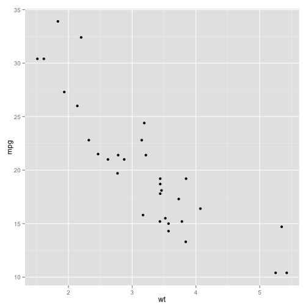
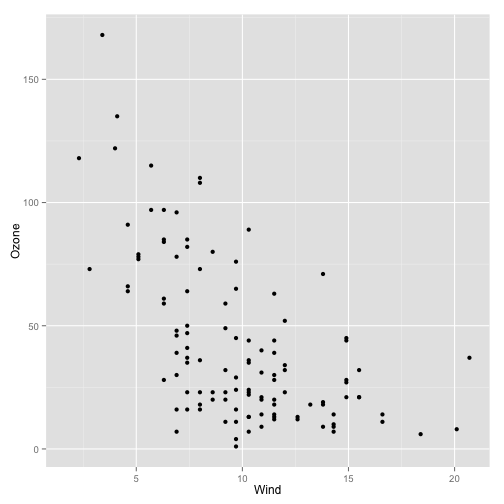

## Princliples of Analytic Graphics

We are trying to tell a *story* about what is happening in the data. This is achieved via the following principles

1. Showing **comparisons**

* Evidence for a hypothesis is always relative to a competing hypothesis ($H_A$ vs $H_0$). Any evidence that you provide or any data summary must be able to also answer the question, "Compared to what?"

(The example in the lecture is unavailable for reproduction; this is my own)

We may believe that more car cylinders lead to a higher mpg. mtcars contain this information 

```r
data(mtcars)
```
Our competing hypotheses may be   
$H_0$: There is no difference in the mpg between cars with 4 and 6 cylinders   
$H_A$: There is a difference in the mpg between cars with 4 and 6 cylinders


```r
boxplot(mpg~cyl, data = mtcars[(mtcars$cyl==4)|(mtcars$cyl==6),], xlab="#cylinders", ylab="miles per galon" )
```

 

2. Showing **causality**, **mechanism**, and **systematic structure**

"Causality" isn't meant to be taken literally here; it's more of a statement of how you believe the world works. For example, if installing an air cleaner in the homes of asthmatic children increased the number of their symptom-free days, we could hypothesize that less particulate matter is entering the child's lungs and triggering symptoms. In this case, we could show a plot that may corroborate that point of view, such plotting side by side the number of symptom free days and the amount of household particulate matter. To **really** confirm the hypothesis, we would have to do an experiment. 

In the mtcars example, we could theorize that the unexpected result is due to the fact that cars with a higher number of cylinders also weigh more, and so, the mpg decrease


```r
par(mfrow = c(1, 2))
boxplot(mpg~cyl, data = mtcars[(mtcars$cyl==4)|(mtcars$cyl==6),], xlab="#cylinders", ylab="Miles per galon" )
boxplot(wt~cyl, data = mtcars[(mtcars$cyl==4)|(mtcars$cyl==6),], xlab="#cylinders", ylab="Weight (lb/1000)" )
```

 
The spread of the weight for cars with 4 cylinders is significantly lower than that of cars with 6 cylinders. This  **does** seem to corroborate the view that the lower mpg is due to an increase in the weight

3. Show multivariate data

Basically, show as much data on a single plot as is possibly reasonable. This allows us to tell a much richer story.  

4. Integrate as many modes of evidence as you can. 

This means competely integrating words, numbers, images and plots

5. Describe and document the evidence with appropriate labels, scales, sources...you need to add credibility to your story!

## Plotting Systems

The process of making a plot involves several considerations, such as

* Where will the plot be made? On the screen? Or in a file?
* How will it be used? For temporary viewing on a screen? In a web browser? Or in a paper, or for a presentation?
* Is there a large amount of data that will go into this plot? 
* Will it be necessary to dynamically resize it? 

### Base

This is the most commonly used system in R. Plots using the Base system involve two steps

1. Initializing the plot
2. Annotating the plot

The *many* parameters of the Base system are documented in ?par.  

Initialization examples: We need to know how to make 

1. Histograms: hist()

```r
hist(x = airquality$Ozone)
```

 
2. Scatterplots: with(data=, plot(colname1, colname2)) 

```r
with(data = airquality, plot(Wind, Ozone) )
```

 
3. Box-and-whisker plots: 

* step 1: set factors as necessary
* step 2: boxplot(variable~factor (ie: y vs x), data)

```r
# Change month into a factor variable, and overwrite the month column
airquality<-transform(airquality, Month<-as.factor(Month)) 
boxplot(Ozone~Month, data = airquality)
```

 

Annotation examples
text() adds labels within the plot
axis() specify axis ticks

title() adds titles. 

```r
with(airquality, plot(Wind, Ozone))
title(main = "Ozone and wind in NYC", xlab = "Wind", ylab = "Ozone")
```

 
The second line isn't really necessary, however

```r
with(airquality, plot(Wind, Ozone, main="Wind vs. Ozone in NYC"))
```

 

points() adds points

Suppose we wanted to highlight the points that all come from the month of May
1. construct the plot
2. use with (data=subsetted data frame, points(col1, col2, color = ))

```r
with(airquality, plot(Wind, Ozone, main="Wind vs. Ozone in NYC"))
with(data = subset(airquality, Month==5), points(Wind, Ozone, col = "blue"))
```

 

legend() adds a legend

```r
#type="n" initiallizes the graphics device, but does not output anything
with(airquality, plot(Wind, Ozone, main="Wind vs. Ozone in NYC", type="n"))
```

 

```r
with(airquality, plot(Wind, Ozone, main="Wind vs. Ozone in NYC", type="n"))
with(data = subset(airquality, Month==5), points(Wind, Ozone, col = "blue"))
with(data = subset(airquality, Month!=5), points(Wind, Ozone, col = "red"))
legend(x = "topright", pch=1, col=c("blue", "red"), legend = c("May", "Other Months"))
```

 
Add a line with abline()

```r
with(airquality, plot(Wind, Ozone, 
                      main="Wind vs. Ozone in NYC", type="n"))
with(data = subset(airquality, Month==5), points(Wind, Ozone, 
                                                 col = "blue"))
with(data = subset(airquality, Month!=5), points(Wind, Ozone, 
                                                 col = "red"))
legend(x = "topright", pch=1, col=c("blue", "red"), 
       legend = c("May", "Other Months"))
abline(lm(Ozone~Wind, airquality))
```

 
Multiple Base plots are drawn by first splitting the graphics device with par(), and then calling plot() as many times as necessary. In this case, we may need a label to cover the entire panel of plots with mtext(text, outer= T). For this to work, the outer margins must be adjusted


```r
par(mfrow = c(1,2), mar = c(4,4,2,1), oma=c(0,0,2,0))
with(data = airquality, {
        plot(Wind, Ozone, main="Wind vs Ozone")
        plot(Wind, Solar.R, main="Wind vs Solar Radiation")
})
mtext(text = "Wind vs Different things", outer = T)
```

 

### Lattice plotting system

The Lattice plotting system is particularly useful for plotting high dimensional data, and for making many, many plots at once. 

Unlike the Base system, which plots directly to the graphics device, Lattice functions return an object of class **trellis**. This object is printed to the graphics device. The object can be saved to an R obeject, but there's no real need to ever do this. 

Main functions

1. xyplot(y-axis~x-axis, | conditioning cariables, data = some data frame) <-scatterplots

```r
library(lattice)
xyplot(x = Ozone~Wind, data = airquality)
```

 

```r
airquality<-transform(airquality, Month<-factor(Month))
xyplot(x = Ozone~Wind|Month, data = airquality, layout = c(5,1))
```

 
Lattice functions have a **panel function** that controlls what happens inside the plot. 


```r
set.seed(10)
x=rnorm(100)
f<-rep(0:1, each=50); f
```

```
##   [1] 0 0 0 0 0 0 0 0 0 0 0 0 0 0 0 0 0 0 0 0 0 0 0 0 0 0 0 0 0 0 0 0 0 0 0
##  [36] 0 0 0 0 0 0 0 0 0 0 0 0 0 0 0 1 1 1 1 1 1 1 1 1 1 1 1 1 1 1 1 1 1 1 1
##  [71] 1 1 1 1 1 1 1 1 1 1 1 1 1 1 1 1 1 1 1 1 1 1 1 1 1 1 1 1 1 1
```

```r
y=x+f-f*x+rnorm(100, sd = .5)
f<-factor(x = f, labels = c("group 1", "group 2"))
xyplot(x = y~x|f, layout = c(2,1))
```

 
panel functions are identified by the "panel." prefix. 

```r
xyplot(x = y~x|f, panel = function(x, y, ...){
        panel.xyplot(x, y, ...)#first call the default panel function to make the points appear
        panel.abline(h = median(y)) # add a horizontal line
})
```

 
(the following examples were obtained from [Quick-R](http://www.statmethods.net/advgraphs/trellis.html))  
2. bwplot() <-box and whiskers plots

```r
attach(mtcars)
```

```
## The following object is masked from package:ggplot2:
## 
##     mpg
```

```r
gear.f<-factor(gear,levels=c(3,4,5),
          labels=c("3gears","4gears","5gears")) 
cyl.f <-factor(cyl,levels=c(4,6,8),
   labels=c("4cyl","6cyl","8cyl")) 
bwplot(cyl.f~mpg|gear.f, layout=(c(1,3)))
```

 
3. dotplot()

```r
dotplot(cyl.f~mpg|gear.f, 
          main="Dotplot Plot by Number of Gears and Cylinders",
   xlab="Miles Per Gallon")
```

 


### ggplot2

This package implemets Wilkinson's *Grammar of Graphics*. It was written by Wickham. The grammar of graphics represents abstaractions of graphics ideas and objects. The grammar tells us that a statistical graphic is a mapping from data to an **aesthetic attribute** (colour, shape, size), geometric objects (like points, lines and bars). 
Factors are very important for indicating subsets of your data. These should be labeled. 
qplot() (the quick plot) is the workhorse function. ggplot() is the core function, and very flexible for doing things that qplot cannot do. 

* How to use qplot()

```r
library(ggplot2)
# scatterplot
qplot(x = wt, y = mpg, data = mtcars)
```

 

```r
# transform data with functions
qplot(x = log(wt), y = mpg, data = mtcars)
```

 

```r
#add a colour aesthetic mapping
# on a continuous scale
qplot(x = wt, y = mpg, data = mtcars, color=cyl)
```

 

```r
levels(mtcars$cyl)
```

```
## NULL
```

```r
# on a discrete scale
qplot(wt, mpg, data=mtcars, colour=factor(cyl))
```

 

```r
# add a shape aesthetic
qplot(x = wt, y = mpg, data = mtcars, shape=factor(cyl))
```

 

```r
# add a size aesthetic
qplot(x = wt, y = mpg, data = mtcars, size=cyl)
```

 

```r
# it is possible to combine aesthetic mappings
qplot(x = wt, y = mpg, data = mtcars, size=qsec, color=factor(cyl))
```

 

```r
qplot(wt, mpg, data=mtcars, size=qsec, color=factor(carb), shape=I(1))
```

 

```r
# add statistics
qplot(wt, mpg, data=mtcars, size=qsec, shape=factor(cyl), geom="point")
```

 

```r
qplot(wt, mpg, data=mtcars, size=qsec, shape=factor(cyl), geom=c("point", "smooth"), method="lm")
```

 

```r
# histograms
qplot(x = mpg, data = mtcars)
```

```
## stat_bin: binwidth defaulted to range/30. Use 'binwidth = x' to adjust this.
```

 

```r
# add colour aesthetic to histograms
qplot(x = mpg, data = mtcars, fill=factor(cyl))
```

```
## stat_bin: binwidth defaulted to range/30. Use 'binwidth = x' to adjust this.
```

 

```r
# changing the display of the bars
qplot(x = mpg, data = mtcars, fill=factor(cyl), position="dodge")
```

```
## stat_bin: binwidth defaulted to range/30. Use 'binwidth = x' to adjust this.
```

 

```r
qplot(x = mpg, data = mtcars, fill=factor(cyl), position="fill")
```

```
## stat_bin: binwidth defaulted to range/30. Use 'binwidth = x' to adjust this.
```

 

```r
qplot(x = mpg, data = mtcars, fill=factor(cyl), position="identity")
```

```
## stat_bin: binwidth defaulted to range/30. Use 'binwidth = x' to adjust this.
```

 

```r
qplot(x = mpg, data = mtcars, fill=factor(cyl), position="dodge")+coord_flip()
```

```
## stat_bin: binwidth defaulted to range/30. Use 'binwidth = x' to adjust this.
```

 

* How to use facets  
If you have a lot of data points, rather than using colour-coding, we may want to split plots out according to a factor. The facets argument takes a variable on the LHS and RHS seperated by a ~. Those on the RHS determine the columns of the panels, and those on the LHS indicate the rows. 


```r
qplot(x = wt, y = mpg, data = mtcars, facets = .~cyl)
```

 

```r
# note what happens when the factor argument is reversed
qplot(x = wt, y = mpg, data = mtcars, facets = cyl~.)
```

 

```r
# we can add even more information
qplot(x = wt, y = mpg, data = mtcars, color=factor(gear), facets = .~cyl)
```

 

```r
qplot(x = wt, y = mpg, data = mtcars, facets = gear~cyl, )
```

 
Compared to qplot(), ggplot() gives more control and flexibility. The basic components of a ggplot() graphic are 

* a data frame
* aesthetic mappings to colour, size, and shape
* geometric objects like points, lines
* facets, for conditional plots
* statistical transformations, like binning, quantiles, and smoothing
* scales (male= red, female =blue)

Using ggplot() is much more like using the Base system, where you add things piece by piece. 

- plot the data
- overlay a summary
- metadata and annotation

```r
g<-ggplot(data = airquality, aes(Wind, Ozone))
summary(g)
```

```
## data: Ozone, Solar.R, Wind, Temp, Month, Day [153x6]
## mapping:  x = Wind, y = Ozone
## faceting: facet_null()
```
If we tried to print g, we would get an error from the fact that ggplot doesn't know how to draw the object yet. Add the geom for  

```r
#points
p<-g+geom_point(); p
```

```
## Warning: Removed 37 rows containing missing values (geom_point).
```

 

```r
#lines
g+geom_line()
```

```
## Warning: Removed 1 rows containing missing values (geom_path).
```

 

```r
#build up more layers
p+geom_smooth()
```

```
## geom_smooth: method="auto" and size of largest group is <1000, so using loess. Use 'method = x' to change the smoothing method.
```

```
## Warning: Removed 37 rows containing missing values (stat_smooth).
## Warning: Removed 37 rows containing missing values (geom_point).
```

 

```r
p+geom_smooth(method = "lm")
```

```
## Warning: Removed 37 rows containing missing values (stat_smooth).
## Warning: Removed 37 rows containing missing values (geom_point).
```

 

```r
# split by facets
p+facet_grid(.~Month)+geom_smooth(method="lm")
```

```
## Warning: Removed 5 rows containing missing values (stat_smooth).
## Warning: Removed 21 rows containing missing values (stat_smooth).
## Warning: Removed 5 rows containing missing values (stat_smooth).
## Warning: Removed 5 rows containing missing values (stat_smooth).
## Warning: Removed 1 rows containing missing values (stat_smooth).
## Warning: Removed 5 rows containing missing values (geom_point).
## Warning: Removed 21 rows containing missing values (geom_point).
## Warning: Removed 5 rows containing missing values (geom_point).
## Warning: Removed 5 rows containing missing values (geom_point).
## Warning: Removed 1 rows containing missing values (geom_point).
```

 

```r
q<-g+geom_point(aes(color=Day), size=2)+facet_grid(.~Month)+geom_smooth(method="lm"); q
```

```
## Warning: Removed 5 rows containing missing values (stat_smooth).
## Warning: Removed 21 rows containing missing values (stat_smooth).
## Warning: Removed 5 rows containing missing values (stat_smooth).
## Warning: Removed 5 rows containing missing values (stat_smooth).
## Warning: Removed 1 rows containing missing values (stat_smooth).
## Warning: Removed 5 rows containing missing values (geom_point).
## Warning: Removed 21 rows containing missing values (geom_point).
## Warning: Removed 5 rows containing missing values (geom_point).
## Warning: Removed 5 rows containing missing values (geom_point).
## Warning: Removed 1 rows containing missing values (geom_point).
```

 
Finally, Annotate

```r
q+labs(x="Wind Strength")+labs(title="Ozone vs Wind over 5 months")+theme_bw()
```

```
## Warning: Removed 5 rows containing missing values (stat_smooth).
## Warning: Removed 21 rows containing missing values (stat_smooth).
## Warning: Removed 5 rows containing missing values (stat_smooth).
## Warning: Removed 5 rows containing missing values (stat_smooth).
## Warning: Removed 1 rows containing missing values (stat_smooth).
## Warning: Removed 5 rows containing missing values (geom_point).
## Warning: Removed 21 rows containing missing values (geom_point).
## Warning: Removed 5 rows containing missing values (geom_point).
## Warning: Removed 5 rows containing missing values (geom_point).
## Warning: Removed 1 rows containing missing values (geom_point).
```

 
